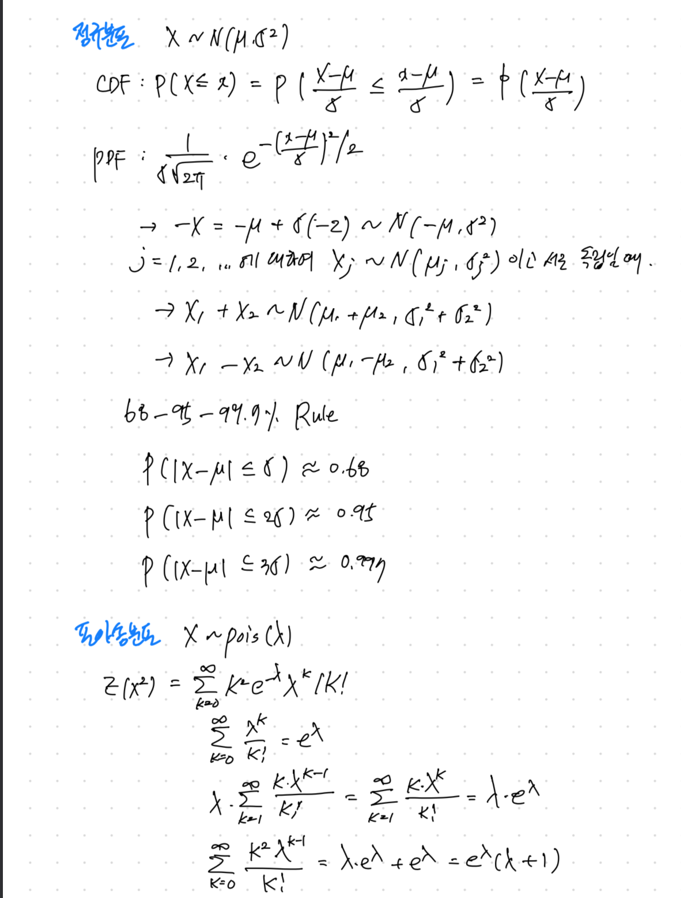
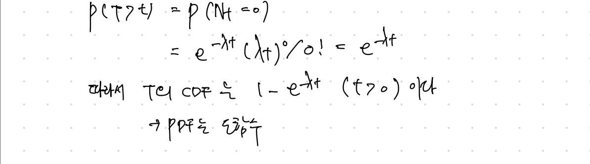

# [하버드 확률론 기초: Statistics 110](https://www.edwith.org/harvardprobability)
Today I Learned

## 1강- 확률과 셈 원리 (Probability and Counting)
## 2강- 해석을 통한 문제풀이 및 확률의 공리 (Story Proofs, Axioms of Probability)
## 3강- Birthday Problem과 확률의 특성 (Birthday Problem, Properties of Probability)
## 4강- 조건부 확률 (Conditional Probability)
## 5강- 조건부 확률과 전확률정리 (Conditioning Continued, Law of Total Probability)
## 6강- Monty Hall 문제와 심슨의 역설 (Monty Hall, Simpson's Paradox)
## 7강- 도박꾼의 파산 문제와 확률변수 (Gambler's Ruin and Random Variables)
## 8강- 확률변수와 확률분포 (Random Variables and Their Distributions)
## 9강- 기댓값, 지시확률변수와 선형성 (Expectation, Indicator Random Variables, Linearity)
## 10강- 기댓값 (Expectation Continued)
## 11강- 포아송분포 (The Poisson distribution)
### 포아송분포 X ~ Pois(λ)
의미: 굉장히 여러 번의 시행을 하지만 성공의 확률은 매우 낮을 때 성공 횟수 세기
ex) 한 시간 동안 오는 이메일의 갯수

PMF:  -> λ 는 속도를 나타내는 모수로, λ > 0 인 상수이다.

### 포아송근사(poisson approximation)
어떤 큰 숫자 n에 대하여 A1,..., An의 사건들이 각각 P(Aj) = pj 라는 낮은 확률로 발생하고,
각 사건은 독립(이거나 weakly dependent) 일 떼, 발생하는 사건(Aj)의 수는 Pois(λ)의 분포를 따른다
  
또한 X ~ Bin(n,p)는  n → ∞ , p → 0 하고 np = λ 가 상수로 유지될 때 (n과 p가 증가하는 속도가 같음)
이항확률변수 X의 분포는 포아송에 근사하게 된다.

ex)길바닥에 빗방울이 떨어지는 횟수 또한 포아송 근사로 설명할 수 있다. 각 사각형에 빗방울이 떨어지는 사건은 이항분포이지만, 그 사건은 서로 독립이다. 빗방울은 많이 떨어지지만 한 사각형 안에 떨어질 확률은 작기 때문에 포아송 분포로도 볼 수 있다.

Birthday Problem(3강) 확장하기
: n명 중에서 생일이 같은 세 명의 사람을 찾을 확률?

## 12강- 이산, 연속, 균등분포 (Discrete vs. Continuous, the Uniform)
### 이산확률변수 vs 연속확률변수
이산확률변수는 확률변수 x가 가질수 있는 값의 가지수가 유한개 or 무한개가 존재해서 하나씩 셀 수 있을 떄의 변수이다
연속확률변수는 확률변수 x가 어떤 구간에서 실수값을 가질때의 변수이다

## 13강- 정규분포 (Normal Distribution)
연속균등분포는 연속 확률 분포로, 분포가 특정 범위 내에서 균등하게 나타나 있을 경우를 가리킨다. 이 분포는 두 개의 매개변수 a,b를 받으며, 이때 [a,b] 범위에서 균등한 확률을 가진다 보통 기호로 u(a,b)로 나타낸다.

### 확륣변수의 독립
확률변수 X1, X2, ..., Xn 가 모든 x1,x2, ..., xn에 대하여

-> 완전한 독립. 쌍으로 독립(pairwise independence) 보다 '센 개념'. (쌍으로 독립이라고 완전히 독립은 아니다)
    ex) X1, X2 ~ iid Bern(1/2) 한 동전 던지기 시행이고
    X3 = 1 (x1 = x2 일 때; otherwise 0) 이라고 하자
        -> (X1, X2), (X2, X3),(X3, X1)는 쌍으로 독립이지만 (X1,X2,X3)은 독립이 아니다 (X1,X2 값이 정해지면 X3 값이 정해진다)

### 정규분포 (Normal Distribution) N(u,σ^2)

## 14강- 위치, 척도 및 무의식적인 통계학자의 법칙(Location, Scale, and LOTUS)

## 15강- Midterm Review
### Coupon Collctor 문제
n가지 장난감을 모아야 전체를 모은다고 할 때, 장난감 전부를 모으는 데까지 걸리는 시간 T(뽑아야 하는 장난감 수) 의 기댓값을 구하시오
T = T1 + T2 + ... + Tn
    T1 = 첫 번째 장난감을 모으는 데까지 걸리는 시간 = 1
    T2 -1 ~ Geom (n-1/ n)
    Tj -1 ~ Geom (n-(j-1)/n)
    
E(T) = E(T1) + ... + E(Tn)
     = 1 + n/n-1 + n/n-2 + ... + n/1 = n (1+ 1/2 + ... + 1/n)
     = nlogn (충분히 큰 n)
     
### 균등분포의 보편성(Universality)
X ~ F

F(x0) = 1/3
P(F(x) <= 1/3) = P(X <= x0)
               = F(X0) = 1/3
       => F(X) ~ Unif(0,1)
       
ex) 로지스틱 분포
    F(x) = e^x / 1 + e^x
    U ~ Unif(0,1)
    log U/1-U ~ logistic
    
### 선형성(linearity)
확률변수 X,Y,Z 가 iid하게 분포하고 양의 값을 가졌다고 할 때 E(X/ X+Y+Z)를 구하시오
E(X/X+Y+Z) = E(Y/X+Y+Z) = E(Z/X+Y+Z) = c <선형성>
E(X+Y+Z/X+Y+Z) = 3c = 1
E(X/X+Y+Z) = c = 1/3

### LOTUS
U ~ Unif(0,1)
X = U^2, Y = e^X 라 할 때 E(Y)를 구하시오

### 포아송 분포 (Poisson distribution)
시간 t까지 받는 이메일의 수가 Pois(λt) 를 따른다고 할 때, 첫 번째 이메일까지 걸리는 시간 T1 의 분포를 구하시오.

## 16강- 지수분포(Exponential Distribution)
### 지수분포(Exponential Distribution) Expo(λ)
-> 모수 λ (rate parameter- 속도를 나타내는 모수). 비율모수, 특정한 사건이 발생할 비율을 나타냄
지수분포의 확률밀도함수는 λ*exp(-λx), x가 양수일 떄 이 값을 갖고 아닐 때는 0의 값을 갖는다 따라서 결과는 항상 양수
누적분포함수를 구하는 것은 확률밀도함수 적분을 통해 쉽게 구할수 있다
0에서 x까지 λ*exp(-λt) 를 t에 대해 적분하면 0보다 큰 x에 대해 1-exp(-λx) 가 된다

기댓값과 분산
Y=λX일 때,  Y ∼ Expo(1)이라는 명제를 증명, 정규분포의 표준화와 유사하지만 완전히 똑같지는 않다
E(X)   = 1 / λ
​Var(X) = 1 / λ²

지수분포의 무기억성 (memoryless property)
지수분포가 중요한 여러이유 중 제일 중요한 점은 바로 무기억성, 무기억성은 얼마나 오래 기다리건 간에 새로 시작하는 것과 같다
어떤 확률변수가 있는데 직관적으로 대기 시간이라 해석할 수 있음 어떤 일이 일어나기를 기다리는 것
전화를 기다리는 있고 지금 시간 t₀ 일때, 연속적인 시간 속 언제든 전화는 올 수 있고 기하분포는 이산분포이다. 동전을 던져서 이길 때까지 기다리는 것
베르누이 시행은 이산시간 동안 이긴 횟수 이산 시행으로 진행되고 여기서는 연속시간이다.
전화가 오기를 기다리는데 이 대기시간의 특징이 얼마나 오래 기다렸든 기다린 시간은 고려하지 않는다 매시간 새롭게 시작하는 것, 이게 바로 무기억성

P(X≥s+t∣X≥s)=P(X≥t) 
이 식이 의미하는 건 이미 s분 동안 기다렸고 아직 전화는 오지않았다
적어도 t분 더 기다려야 하는 확률은 P(X≥t) 와 같다 새로ㅗㅂ게 시작하는 것과 같기 때

조건부 기댓값(conditional expectation)
E(X∣X>a) = a+E(X−a∣X>a)  ⋯  ( X-a는 a만큼 기다린 후 남는 대기시간 무기억성에 의해 새로운 지수분포가 된다)
= a + (1 / λ)

X> a 가 주어질 때 X-a 는 새로운 지수분포가 된다 이 부분은 a 이상 이미 기다렸지만 결국 새로 다시 시작한다.
 ​​  
​​
17강- 적률생성함수(Moment Generating Functions)
18강- 적률생성함수_2 (MGFs Continued)
19강- 결합, 조건부, 주변 확률질량함수(Joint, Conditional, and Marginal Distributions)
20강- 다항분포 및 코시분포(Multinomial and Cauchy)
21강- 공분산과 상관계수(Covariance and Correlation)
22강- 변수변환과 합성곱(Transformations and Convolutions)
23강- 베타분포(Beta disctribution)
24강- 감마분포와 포아송 과정(Gamma distribution and Poisson process)
25강- 순서통계량과 조건부 기댓값(Order Statistics and Conditional Expectations)
26강- 조건부 기댓값_2(Conditional Expectation Continuted)
27강- 조건부 기댓값_3(Conditional Expectation given an R.V.)
28강- 부등식(Inequalities)
29강- 큰 수의 법칙과 중심극한정리(Law of Large Numbers and Central Limit Theorem)
30강- 카이제곱분포, t분포, 다변량정규분포(Chi-Square, Student-t, Multivariate Normal)
31강- 마코프 체인(Markov Chains)
32강- 마코프 체인_2(Markov Chains Continued)
33강- 마코프 체인_3(Markov Chains Continued Further)
34강- A Look Ahead