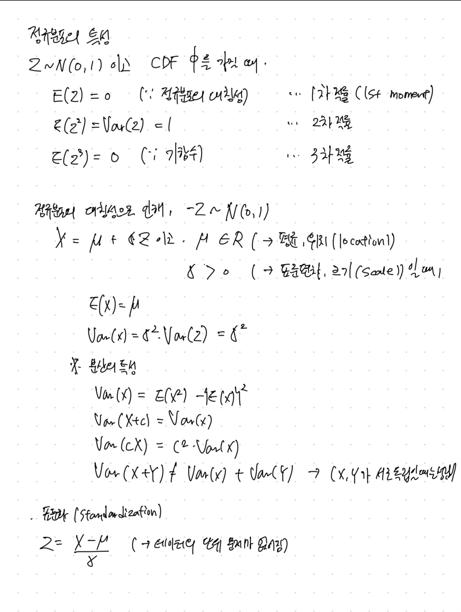
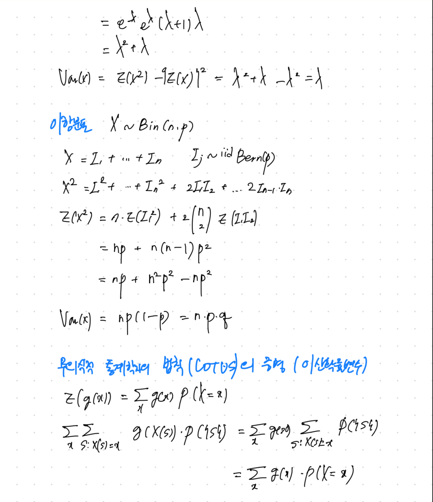

확률론의 활용영역:
- 유전학, 물리학, 계량경제학, 금융, 역사학, 정치
- 인문학, 사회과학계에서도 중요도와 활용이 늘어나고 있음
- 도박과 게임 - 통계에서 여러 번 연구된 주제이다(페르마, 파스칼)
- 인생 전반 : 수학이 확실성에 대한 학문이라면 확률은 불확실성(uncertainty)을 계량화하는 것을 가능하게 해 준다.
표본공간(sample space) : 시행에서 발생 가능한 모든 경우의 집합
사건(event) : 표본공간의 부분집합
확률의 naive한 정의
P(A) = (사건 A가 발생하는 경우의 수) / (발생 가능한 모든 경우의 수)
    내포하고 있는 가정 : 
        - 모든 사건이 발생할 확률은 같다
        - 유한한 표본공간
        - 항상 이 가정이 만족되는 것은 아니기 때문에 적용 불가한 경우들이 있다

셈 원리(Counting Principle)
- 곱의 법칙(Multiplication Rule) : 발생 가능한 경우의 수가 n1, n2, ,,, nr 가지인 1,2, ,,, r 번의 시행에서 발생 가능한 모든 경우의 수는
  n1 * n2 * ... * nr 이다
이항계수(Binomial Coefficient): 크기 n의 집합에서 만들 수 있는 크기 k인 부분집합의 수(순서 관계없이)
(n)  = n! / (n-k)!k!
(k)

표본추출 정리한 표(sampling Table) : n개 중에서 k개 뽑기

|-|순서상관 있음|순서 상관 없음|
|------|---|---|
|복원|n^k|(n+k-1)|
|복원|.|(k)|
|비복원|n * (n-1) * ... * (n-k+1)|(n)|
|비복원|.|(k)|

## 2강- 해석을 통한 문제풀이 및 확률의 공리 (Story Proofs, Axioms of Probability)
Sampling Table(cont.)
다른 경우들은 곱의 법칙으로 설명이 되지만, (복원, 순서 상관이 없는) 경우 그렇지 않음.

n개에서 k개를 순서 상관없이, 복원하며 뽑는 경우의 수 : ( n+k-1 )
                                           (   k   )
일반적인 경우 k = 1 대입 
극단적인 경우 k = 0 대입
간단하지만 당연하지는 않은 값 n=2 대입

-> 일반화: n개의 상자에 k개의 구별 불가능한 object 들을 넣을 수 있는 경우의 수는 얼마인가
(  n + k - 1 )
(    n - 1   )

<-> n개의 구슬을 k개의 상자에 넣는 경우의 수는 몇 가지인가?

구슬과 같이 실물이 있는 물체는 labeling이 가능하며 서로 구별이 가능하다 따라서 확률의 naive한 정의로 접근이 가능하다 하지만 물리학 counting problem에서의 경우에는 object들이 항상 구별 가능한 것이 아니기 떄문에 이와 같은 접근이 어렵다
<-> n개의 원 사이에 k -1 개의 구분선을 넣는 경우의 수는 몇 가지인가?

위 문제는 n+k-1 개의 위치에 원과 구분선을 배열하는 것과 같다 원의 위치를 먼저 정하면 구분선의 위치도 결정되고, 그 반대도 성립하기 떄문에, 다음과 같은 등식이 성립함을 확인할 수 있다
(  n + k - 1 )  =  (  n + k - 1 )
(    n - 1   )     (      k     )   

Story proof : 상황 해석을 통한 증명 (대수적 방법으로 접근하는 것보다 훨씬 쉬울떄가있음)
ex2) n명 중에서 k명 뽑기, k명 중에서 한 명을 회장으로 뽑는 문제로 해석
     -> 회장을 먼저 뽑고 나머지 k명에 들어갈 사람 뽑기 <-> k명을 뽑고 그 중에서 회장 뽑기

## 3강- Birthday Problem과 확률의 특성 (Birthday Problem, Properties of Probability)
Birthday Problem : k명 중에 2명 이상이 같은 생일을 가질 확률 (일별 출생 확률은 동일하고 각각의 사건은 독립적으로 발생한다고 가정한다)
k가 몇 명 이상이어야 같은 생일을 가진 사람들이 있을 확률이 50%일까
k <= 365 라 할 때,
p(k명의 생일이 모두 다름) = 365 * 365 * ... * (365 -k+1) / 365^k
 -> k = 23 명 일 때 50.7%, k = 50 명 일 때 97%, k = 100 명 일때 99.9%
직관적으로 푸는 방법?
-> (23) = 253 개의 '짝'이 나옴
   (2 )
  

## 4강- 조건부 확률 (Conditional Probability)
### Independence
정의) P(A ∩ B) = P(A)P(B) 이 성립할 때, 사건 A와 B는 독립이다.
주의하기: 서로소(disjoint)와 구별하기 A와 B가 서로소인 사건이라면, A가 발생했을 때 B는 빌셍힐 수 없다.
(한편, A와 B가 독립이라면, 사건 A의 발생은 B의 발생여부에 대한 그 어떤 영향도 끼치지 않음)
    P(A ∩ B) = P(A)P(B), P(B ∩ C) = P(B)P(C), P(C ∩ A) = P(C)P(A)
    P(A ∩ B ∩ C) = P(A)P(B)P(C) 가 모두 성립할 때, 사건 A, B, C는 독립이다
        -> 쌍으로 독립(pairwise independence)과 전체 독립 모두 확인해야 A,B,C 의 독립을 확인할 수 있다.
        
    예제) Newton-Pepys problem(1693) - 공정한 주사위를 갖고 있을 때 다음 중 어떤 경우가 발생할 확률이 가장 높은가?
       a) 6개의 주사위 중에서 적어도 한 개가 '6'이 나온 경우
       b) 12개의 주사위 중에서 적어도 두 개가 '6'이 나온 경우
       c) 18개의 주사위 중에서 적어도 세 개가 '6'이 나온 경우
            -> 답은 (a)
            
    풀이) '적어도 몇 개' 라는 표현이 나오면 합집합을 생각하기 -> 합집합의 여집합은 교집합
       -> 모든 사건이 독립이기 때문에 곱셈으로 구할 수 있음
            P(A) = 1 - (5/6)^6 = .665
            P(B) = 1 - (6이 한 번도 안 나올 확률 + 6이 딱 한 번 나올 확률)
                 = 1 - {(5/6)^12 + 1/6*12*(5/6)^11} = .619
            P(C) = .597
            
            (a)가 가장 발새할 확률이 높다
            
### Conditional Probability : 새로운 정보를 얻었을 때, 기존의 믿음/불확실성(uncertainty)을 어떻게 업데이트 하는가?
정의) P(A|B) = P(A ∩ B)/ P(B), (P(B) > 0 이다)
직관적 접근 1) 조약돌 세계관
    S안에 q 개의 조약돌이 있다고 하자 그리고 이 조약돌들의 질량의 총합이 1이라고 하자.
    Bc에 있는 모든 조약돌들을 무시하고 B가 전부라고 여겼을 때, B안에서 A도 발생할 확률은 P(A|B) 이다.
    그런데 B에 있는 질량의 총합이 1이 안 되기 떄문에, 다시 표준화(normalize) 하는 작업이 필요하다
    따라서 P(A|B) 에 P(B)를 곱해줘야 한다 
    P(A ∩ B) = P(A|B)P(B)

직관적 접근 2) 빈도학파 세계관
    같은 실험을 무한 번 반복할 수 있다면 
    ~ 로 표시한 사건 B가 일어난 경우들 중, 사건 A 또한 발생한 것은 전체 시행 시간에서 얼마나 차지하는가?   
    
정리
P(A|B) = P(B|A)P(A) / P(B) -> 이를 베이즈의 정리 (Bayes' Theorem) 라 한다.
    

## 5강- 조건부 확률과 전확률정리 (Conditioning Continued, Law of Total Probability)
### 문제 푸는 방법
- 간단한 케이스와 극단적인 케이스에 적용해보기
- 문제를 작은 문제들로 쪼개서 생각해보기
A1, A2, A3, A4 : 전체인 S를 분할한 것 (서로소)
주어진 자료로 문제를 잘 '분할'하여 접근하기

S를 A1, A2, ... An의 서로소인 분할들로 나누어 놓았다고 했을 때,
P(B) = P(B ∩ A1) + P(B ∩ A2) + ... + P(B ∩ An) 가 성립하여, 이는 곧 
     = P(B|A1)P(A1) + P(B|A2)P(A2) + ... + P(B|An)P(An) 로도 다시 쓰일 수 있다.
이를 전체 확률의 법칙 (Law of Total Probability) 라고 한다.

예제1) 카드 한 벌에서 무작위로 두 장을 뽑았을 때, 
   i) P(두 장 다 에이스| 에이스를 뽑음)
        = P(두 장 다 에이스) / P(에이스를 뽑음)
        
   ii) P(두 장 다 에이스| 스페이드 에이스를 뽑음) 
        [♠] [?] 
        한 장의 카드는 스페이드 에이스로 정해져 있기 때문에, 두 장의 카드 중에서 [?]에 해당하는 한 장의 카드를 나머지 3개의 에이스 중에서 뽑으면 된다.
        따라서 구하는 확률 = 3/51 = 1/17

예제2) 인구의 1%가 걸리는 병이 있고, 이 병의 검사 결과가 95%의 정확도를 갖고 있다고 하자. 검사가 양성으로 나왔을 때, 실제로 이 병에 걸렸을 경우는
    병에 걸리는 사건을 D, 검사 결과 양성으로 나오는 사건을 T라고 하자
    문제에서 P(D) = 0.01 로 주어졌고, 95% 의 정확도를 갖고 있다' 를 P(T|D) = P(T^c|D^c) = 0.95 라고 해석할 수 있다고 가정하면,
    구하고자 하는 확률 P(D|T) 는 
    = P(T∣D)P(D)​ / P(D) = P(T|D) / P(T|D)P(D) + P(T|D^c)P(D^c) 과 같이 구할 수 있다.
    
조건부 확률 문제를 풀며 자주 하는 실수
1. P(A|B) 와 P(B|A)를 헷갈리는 것 : '조건'과 '구하고자 하는 것'을 확실히 알기!
2. P(A) '사전확률' (prior)과 P(A|B) '사후확률' (posterior)를 헷갈리는 것
3. 독립과 조건부 독립을 헷갈리는 것

조건부 독립: 'A와 B는 조건 C 하에서 독립이다'
정의) P(A ∩ B | C) = P(A|C) P(B|C)
    조건부 독립 -> 독립이 성립하는가? FALSE
    독립 -> 조건부 독립이 성립하는가? FALSE
            
## 6강- Monty Hall 문제와 심슨의 역설 (Monty Hall, Simpson's Paradox)
### Monty Hall 문제
세 개의 문 중에 하나 뒤에는 자동차가 있고, 나머지 두 개 뒤에는 염소가 있다. Monty가 내가 고르지 않은 문 중 하나를 열어 염소가 있는 것을 보여줬다면,
나는 처음 고른 문에서 바꾸는 것이 유리한가, 그렇지 않은가?

ii) 전체 확률의 법칙으로 풀기
    S: 처음 선택에서 바꿔서 자동차 있는 문을 맞추는 사건
    Dj : j번 문 뒤에 자동차가 있는 사건 (j ∈ {1,2,3})
    P(S) = P(S|D1) * 1/3 + P(S|D2) * 1/3 + P(S|D3) * 1/3
         = 0 + 1 * 1/3 + 1 * 1/3 = 2/3
    또한 Monty는 내가 고르지 않은 두 개의 문이 둘 다 염소가 있다면 두 문을 열 확률은 같으므로 
    P(S| Monty가 2번문을 연다) = 2/3 = P(S) 으로, 조건부 확률과 조건부가 아닌 확률 값이 일치한다.

### Simpson's Paradox(심슨의 역설) : 부분에서 성립하는 대소 관계는 전체를 보았을 떄 역전될 수도 있다. 
예시) 심슨 가족이 사는 스프링필드에 Dr. Hibbert와 Dr.Nick, 두 명의 의사가 있고, 그들은 심장 수술과 반창고 제거 두 가지 수술을 한다고 하자

의사들의 수술종류별 성공률을 보았을 때, Dr.Hibbert 가 더 좋은 의사임은 분명하다.
하지만 Dr.Nick 이 더 높은 전체 수술 성공률을 근거로 스스로의 경쟁력을 주장한다면, 이 또한 틀린말은 아니다.
심슨 역설 예시 ( https://en.wikipedia.org/wiki/Simpson%27s_paradox)

이론적 접근
A: 수술이 성공하는 사건
B: Dr.Nick 가 수술을 집도하는 사건
C: 심장 수술을 받는 사건

심장) P(A|B,C) < P(A|B^C, C))
반창고 P(A|B,C^C) < P(A|B^C,C^C) 로 Dr.Hibbert가 각각의 수술이라는 조건부 확률에서는 더 좋은 성적을 보일 수 있지만
무조건부 확률은 P(A|B) > P(A|B^C) 와 같이 역전될 수가 있다는 것이다
 -> 여기서 C(수술의 종류)는 confounder(교란변수)라고 하며, 이렇게 적절한 confounder 에 의한 조건부 확률을 확인하지 않으면 상황에 대한 그릇된 판단을 내릴 위험이 있다.

전체 확률의 정의를 이용해 심슨의 역설이 틀렸음을 증명할 수 있는가?
P(A|B) = P(A|B,C)P(C|B) + P(A|B,C^C)P(C^C|B) 에서 문제에서 주어진 조건에서 
P(A|B,C) < P(A|B^C, C), P(A|B,C^C) < P(A|B^C, C^C) 는 확인 가능하지만, P(C|B), P(C^C|B) 가 좌항, 우항에 서로 다른 가중치로 작용하기 떄문에 증명할 수 없다.

## 7강- 도박꾼의 파산 문제와 확률변수 (Gambler's Ruin and Random Variables)
### Gambler's Ruin(도박꾼의 파산)
A와 B 두 명의 도박꾼이 매 라운드 $1씩 걸고 도박을 한다. 이긴 사람은 상대방의 $1을 가져가고, 둘 중 한 명이 가지고 온 돈이 바닥날 때까지 이 과정을 반복한다.
p = P ( A가 어떤 라운드를 이긴다)
q = 1 - p
A는 i달러, B는 N-i 달러를 가지고 게임을 한다고 할 떄,

p의 확률로 A가 1달러를 더 얻고, q의 확률로 1달러를 잃는다.
0, N은 흡수상태 (absorbing state)라 하여, 게임 종료를 나타낸다.

pi : A가 i달러로 시작하여 게임을 이길 확률
pi = p*pi+1 + q*pi-1 (1 ≤ i ≤ N-1) 이고, p0 = 0, pN = 1 이다.
이를 계차방정식 (difference equation)이라고 한다 (미분방정식의 이산 형태)

guessing을 통한 풀이

해석
하우스와 같은 돈을 가지고 시작하고 1% 정도로만 불공평한 게임이라고 해도 게임을 계속하다 보면 이길 확률이 매우 적어지게 된다. (도박꾼의 파산)
확인할점 : 게임이 끝나지 않고 영원히 계속될 확률이 있는가
게임이 공평한 상황에서 (p = q) B가 (N-i 달러를 갖고 이길 확률은 N-i / N 이다
i/N + (N-i) / N = 1 이므로 게임이 계속될 확률은 0이다.

### 확률변수(Random Variable) : 표본공간 S부터 실수 체계 R로 '맵핑' 하는 함수

 
예시) 베르누이 (Bernoulli) 확률변수
 X가 0(실패), 1(성공) 두 가지의 값만 가질 수 있으며, P(x=1) = p, P(X=0) = 1 - p 일 때 X는 Bernoulli(p) 분포를 따른다고 한다.
 
예시) 이항 (Binomial) 확률변수
 n번의 독립적인 베르누이 (p) 시행에서 성공 횟수의 분포는 Bin(n,p) 를 따른다고 한다
 - 이항확률변수의 확률질량변수(PMF) : P(X=k) = 
 - 이항확률변수의 특징
   X ~ Bin(n,p), Y ~ Bin(m,p) 일 때, X + Y ~ Bin(n+m, p)를 따른다.
   
## 8강- 확률변수와 확률분포 (Random Variables and Their Distributions)
### 이항분포 Bin(n,p)

## 9강- 기댓값, 지시확률변수와 선형성 (Expectation, Indicator Random Variables, Linearity)
## 10강- 기댓값 (Expectation Continued)
## 11강- 포아송분포 (The Poisson distribution)
### 포아송분포 X ~ Pois(λ)
의미: 굉장히 여러 번의 시행을 하지만 성공의 확률은 매우 낮을 때 성공 횟수 세기
ex) 한 시간 동안 오는 이메일의 갯수

PMF:  -> λ 는 속도를 나타내는 모수로, λ > 0 인 상수이다.

### 포아송근사(poisson approximation)
어떤 큰 숫자 n에 대하여 A1,..., An의 사건들이 각각 P(Aj) = pj 라는 낮은 확률로 발생하고,
각 사건은 독립(이거나 weakly dependent) 일 떼, 발생하는 사건(Aj)의 수는 Pois(λ)의 분포를 따른다
  
또한 X ~ Bin(n,p)는  n → ∞ , p → 0 하고 np = λ 가 상수로 유지될 때 (n과 p가 증가하는 속도가 같음)
이항확률변수 X의 분포는 포아송에 근사하게 된다.

ex)길바닥에 빗방울이 떨어지는 횟수 또한 포아송 근사로 설명할 수 있다. 각 사각형에 빗방울이 떨어지는 사건은 이항분포이지만, 그 사건은 서로 독립이다. 빗방울은 많이 떨어지지만 한 사각형 안에 떨어질 확률은 작기 때문에 포아송 분포로도 볼 수 있다.

Birthday Problem(3강) 확장하기
: n명 중에서 생일이 같은 세 명의 사람을 찾을 확률?

## 12강- 이산, 연속, 균등분포 (Discrete vs. Continuous, the Uniform)
### 이산확률변수 vs 연속확률변수
이산확률변수는 확률변수 x가 가질수 있는 값의 가지수가 유한개 or 무한개가 존재해서 하나씩 셀 수 있을 떄의 변수이다
연속확률변수는 확률변수 x가 어떤 구간에서 실수값을 가질때의 변수이다

## 13강- 정규분포 (Normal Distribution)
연속균등분포는 연속 확률 분포로, 분포가 특정 범위 내에서 균등하게 나타나 있을 경우를 가리킨다. 이 분포는 두 개의 매개변수 a,b를 받으며, 이때 [a,b] 범위에서 균등한 확률을 가진다 보통 기호로 u(a,b)로 나타낸다.

### 확륣변수의 독립
확률변수 X1, X2, ..., Xn 가 모든 x1,x2, ..., xn에 대하여

-> 완전한 독립. 쌍으로 독립(pairwise independence) 보다 '센 개념'. (쌍으로 독립이라고 완전히 독립은 아니다)
    ex) X1, X2 ~ iid Bern(1/2) 한 동전 던지기 시행이고
    X3 = 1 (x1 = x2 일 때; otherwise 0) 이라고 하자
        -> (X1, X2), (X2, X3),(X3, X1)는 쌍으로 독립이지만 (X1,X2,X3)은 독립이 아니다 (X1,X2 값이 정해지면 X3 값이 정해진다)

### 정규분포 (Normal Distribution) N(u,σ^2)

## 14강- 위치, 척도 및 무의식적인 통계학자의 법칙(Location, Scale, and LOTUS)

## 15강- Midterm Review
### Coupon Collctor 문제
n가지 장난감을 모아야 전체를 모은다고 할 때, 장난감 전부를 모으는 데까지 걸리는 시간 T(뽑아야 하는 장난감 수) 의 기댓값을 구하시오
T = T1 + T2 + ... + Tn
    T1 = 첫 번째 장난감을 모으는 데까지 걸리는 시간 = 1
    T2 -1 ~ Geom (n-1/ n)
    Tj -1 ~ Geom (n-(j-1)/n)
    
E(T) = E(T1) + ... + E(Tn)
     = 1 + n/n-1 + n/n-2 + ... + n/1 = n (1+ 1/2 + ... + 1/n)
     = nlogn (충분히 큰 n)
     
### 균등분포의 보편성(Universality)
X ~ F

F(x0) = 1/3
P(F(x) <= 1/3) = P(X <= x0)
               = F(X0) = 1/3
       => F(X) ~ Unif(0,1)
       
ex) 로지스틱 분포
    F(x) = e^x / 1 + e^x
    U ~ Unif(0,1)
    log U/1-U ~ logistic
    
### 선형성(linearity)
확률변수 X,Y,Z 가 iid하게 분포하고 양의 값을 가졌다고 할 때 E(X/ X+Y+Z)를 구하시오
E(X/X+Y+Z) = E(Y/X+Y+Z) = E(Z/X+Y+Z) = c <선형성>
E(X+Y+Z/X+Y+Z) = 3c = 1
E(X/X+Y+Z) = c = 1/3

### LOTUS
U ~ Unif(0,1)
X = U^2, Y = e^X 라 할 때 E(Y)를 구하시오

### 포아송 분포 (Poisson distribution)
시간 t까지 받는 이메일의 수가 Pois(λt) 를 따른다고 할 때, 첫 번째 이메일까지 걸리는 시간 T1 의 분포를 구하시오.

## 16강- 지수분포(Exponential Distribution)
### 지수분포(Exponential Distribution) Expo(λ)
-> 모수 λ (rate parameter- 속도를 나타내는 모수). 비율모수, 특정한 사건이 발생할 비율을 나타냄
지수분포의 확률밀도함수는 λ*exp(-λx), x가 양수일 떄 이 값을 갖고 아닐 때는 0의 값을 갖는다 따라서 결과는 항상 양수
누적분포함수를 구하는 것은 확률밀도함수 적분을 통해 쉽게 구할수 있다
0에서 x까지 λ*exp(-λt) 를 t에 대해 적분하면 0보다 큰 x에 대해 1-exp(-λx) 가 된다

기댓값과 분산
Y=λX일 때,  Y ∼ Expo(1)이라는 명제를 증명, 정규분포의 표준화와 유사하지만 완전히 똑같지는 않다
E(X)   = 1 / λ
​Var(X) = 1 / λ²

지수분포의 무기억성 (memoryless property)
지수분포가 중요한 여러이유 중 제일 중요한 점은 바로 무기억성, 무기억성은 얼마나 오래 기다리건 간에 새로 시작하는 것과 같다
어떤 확률변수가 있는데 직관적으로 대기 시간이라 해석할 수 있음 어떤 일이 일어나기를 기다리는 것
전화를 기다리는 있고 지금 시간 t₀ 일때, 연속적인 시간 속 언제든 전화는 올 수 있고 기하분포는 이산분포이다. 동전을 던져서 이길 때까지 기다리는 것
베르누이 시행은 이산시간 동안 이긴 횟수 이산 시행으로 진행되고 여기서는 연속시간이다.
전화가 오기를 기다리는데 이 대기시간의 특징이 얼마나 오래 기다렸든 기다린 시간은 고려하지 않는다 매시간 새롭게 시작하는 것, 이게 바로 무기억성

P(X≥s+t∣X≥s)=P(X≥t) 
이 식이 의미하는 건 이미 s분 동안 기다렸고 아직 전화는 오지않았다
적어도 t분 더 기다려야 하는 확률은 P(X≥t) 와 같다 새로ㅗㅂ게 시작하는 것과 같기 때

조건부 기댓값(conditional expectation)
E(X∣X>a) = a+E(X−a∣X>a)  ⋯  ( X-a는 a만큼 기다린 후 남는 대기시간 무기억성에 의해 새로운 지수분포가 된다)
= a + (1 / λ)

X> a 가 주어질 때 X-a 는 새로운 지수분포가 된다 이 부분은 a 이상 이미 기다렸지만 결국 새로 다시 시작한다.
 
 
 
 ​​  
​## 17강- 적률생성함수(Moment Generating Functions)
### 무기억성(memoryless property)

→ 이산확률분포는 기하분포, 연속확률분포는 지수분포에서만 적용됨.
기대수명에 대한 기사 내용은 많이 오해하는 내용으로 예를들면 마지막으로 찾아본 미국의 기대수명은 남성은 76세, 여성은 81세였습니다
어떻게 숫자가 나왔을까? 왜냐하면 원칙적으로 내일 태어날 아기의 기대수명을 알고 싶다면 원칙적으로 해야할일은 내일 태어날 아기들을 조사해 죽을때까지 기다린 후 나이를 평균낸다.
두 번째로는 그 순간까지 죽은 사람들만 고려해 평균을 내다보면 편향적인 결과를 얻게된다. 좀 더 오래 산 사람들은 무시하게 되는 것이라, 이런 예시를 중도절단 자료라고 한다
뉴스 기사에서 본 잘못된 점은 근본적으로 가정을 모든 사람에게 80세라고 하는 것. 조건부 기댓값은 이런 정보가 주어질 때 기댓값을 계산하는데 비조건부 혹률 대신 조건부 확률을 사용

인간의 일생이 무기억성이라면 그리고 평균 수명이 80세라면 20세까지 살았다면 새로운 기대수명은 100이 됩니다?
무기억성에 의하면 언제나 새롭게 시작합니다. 얼마나 오래 살았던지 추가로 평균 80년을 더 살 수 있다. 

와이블분포는 지수분포의 거듭제곱형태. 지수확률변수를 세 제곱하면 더는 지수분포도 아니고 무기억성도 아니게 된다 이걸 와이블분포라고 한다

연속확률변수 X가 무기억성이 있으면 X ~ Expo(λ)
proof)  X의 CDF  F → G(x) = P(X≥x) = 1−F(x) 라 할 때,
G(s+t) = G(s)G(t) ... 무기억성
s=t라 하였을 때  G(2t) = G(t)^2
              G(kt) = G(t)^​k (k는 양의 정수)
​​ 
-> G(xt) = G(t)^x for all real x>0 

### 적률생성함수(Moment Generating Function)
정의
확률변수 X의 적률생성함수  M(t) = E(e^{tX}), 누적분포함수나 확률밀도함수처럼 분포를 설명하는 또 다른 방법 
t는 무엇을 의미할까? t는 단지 가변수이다. 빈칸을 채우는 용도.
MGF 는 무슨 뜻일까? 모든 실수 t에 관한 확률변수에 대한 함수도 확률변수. 모든 MGF는 분포의 적률을 추적하기 위해 부기하는 수

활용
1. n차 적률 E(X^n)은 M의 테일러 전개식에서  t^n / n! 의 계수이다 (i.e., M^{(n)}(0) = E(X^n))
2. 같은 MGF를 가진 확률변수들은 같은 확률분포를 가진다. // 포아송 분포의 3차 MGF라는 것을 알아차리면 그럼 세개의 확률변수인 포아송 분포라는 것을 결론낼수있다
3. 확률변수 X는 MGF M_X , Y는 MGF M_Y 를 가질 때, X+Y의 기댓값 E(e^{t(X+Y)}) = E(e^{tX})E(e^{tY})= M_X * M_Y​ 를 만족한다 (X,Y는 독립)
 // 독립적인 확률변수의 합의 분포를 구하는 것은 복잡 합성곱, 하지만 MGF를 접근할 수 있다면 쉽다
 
확률분포의 MGF 구하기

라플라스의 후속 규칙 - 내일 해가 뜰 확률은 얼마인가?

18강- 적률생성함수_2 (MGFs Continued)
19강- 결합, 조건부, 주변 확률질량함수(Joint, Conditional, and Marginal Distributions)
20강- 다항분포 및 코시분포(Multinomial and Cauchy)
21강- 공분산과 상관계수(Covariance and Correlation)
22강- 변수변환과 합성곱(Transformations and Convolutions)
23강- 베타분포(Beta disctribution)
24강- 감마분포와 포아송 과정(Gamma distribution and Poisson process)
25강- 순서통계량과 조건부 기댓값(Order Statistics and Conditional Expectations)
26강- 조건부 기댓값_2(Conditional Expectation Continuted)
27강- 조건부 기댓값_3(Conditional Expectation given an R.V.)
28강- 부등식(Inequalities)
29강- 큰 수의 법칙과 중심극한정리(Law of Large Numbers and Central Limit Theorem)
30강- 카이제곱분포, t분포, 다변량정규분포(Chi-Square, Student-t, Multivariate Normal)
31강- 마코프 체인(Markov Chains)
32강- 마코프 체인_2(Markov Chains Continued)
33강- 마코프 체인_3(Markov Chains Continued Further)
34강- A Look Ahead